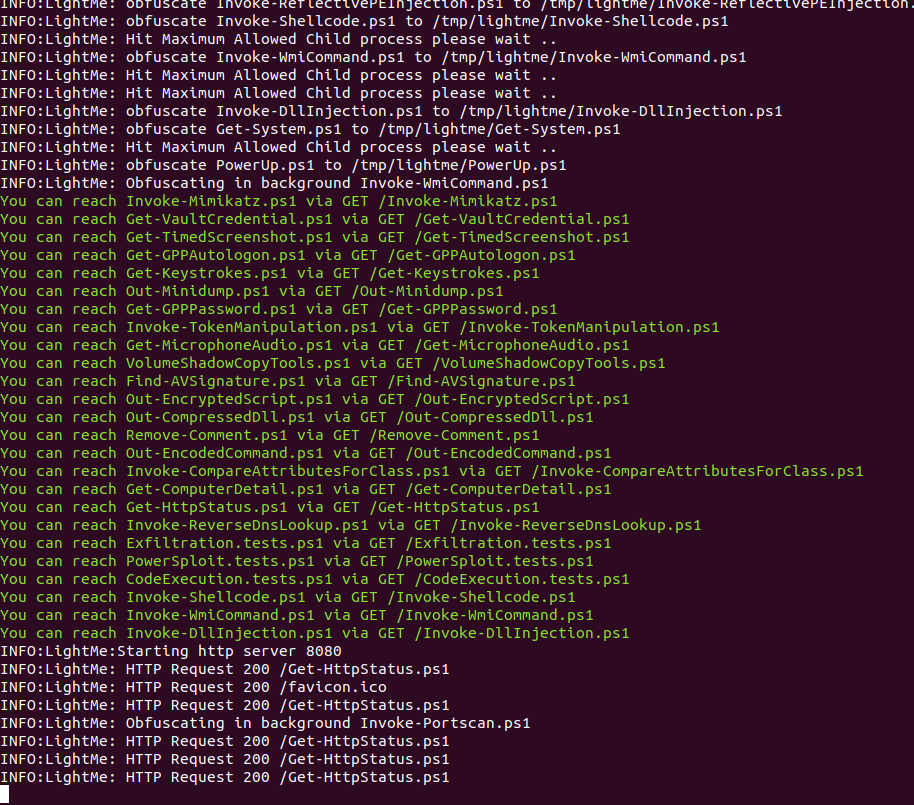

<h1 align="center">
  LightMe
  <br>
</h1>

LightMe is a Simple HTTP Server serving Powershell Scripts/Payloads after Obfuscate them
and run obfuscation as a service in backgroud in order to keep obfuscate the payloads 
which giving almost new obfuscated payload on each HTTP request 

<h1 align="center">
<br>
</h1>


### Main Features
- Obfuscate all powershell files within a specific directory
- HTTP Server to serve the obfuscated Powershell Files
- Background Obfuscator
- Almost new Payload on each request , (depanding on ```Background obfuscation interval```) 
- Powered by [Invoke-Obfuscation](https://github.com/danielbohannon/Invoke-Obfuscation)

### Install
```shell
git clone --recurse-submodules https://github.com/WazeHell/LightMe
cd LightMe/

# install powershell
sudo apt-get install powershell
```

### Using
```shell
python3 lightme.py --help
```

### Running as services
```
#install supervisor
sudo apt-get install supervisor

sudo vim /etc/supervisor/conf.d/lightme.conf

# edit the config
[program:lightme_server]
directory=/lightme_path/
command=/usr/bin/python3 lightme.py -path /PowerSploitOrWhatever/
numprocs=1
user=yourusername
autostart=true
autorestart=true
stdout_logfile=/lightme_path/lightme_std.log
stderr_logfile=/lightme_path/lightme_stderr.log
redirect_stderr=true
priority=999
stdout_logfile_maxbytes=5MB
stderr_logfile_maxbytes=5MB
environment=LANG=en_US.UTF-8,LC_ALL=en_US.UTF-8


# Run
sudo service supervisor restart
sudo supervisorctl reread
sudo supervisorctl update
sudo supervisorctl restart all
```
